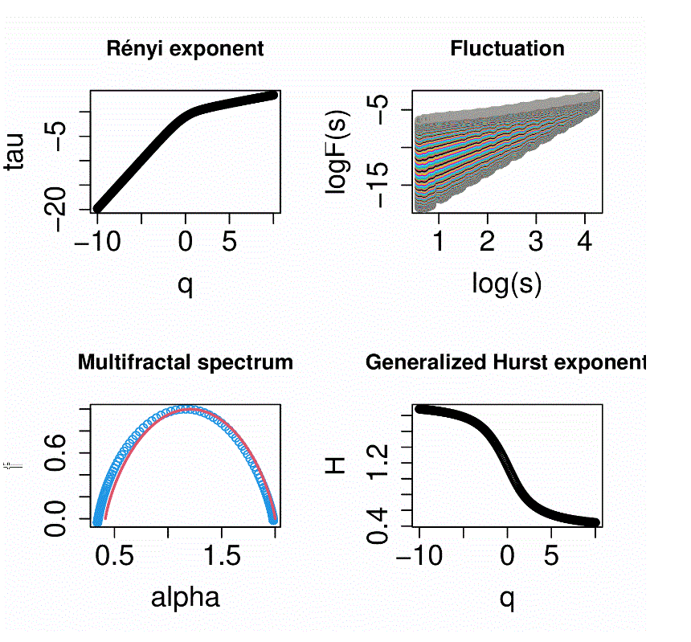

# Multifractal detrended fluctuation analysis - MFDFA

## Introduction
This code repository implements MFDFA algorithm (https://doi.org/10.1016/S0378-4371(02)01383-3) in C, R and Python, representing a unified platform for these software environments.

## Setup
The library is written in C, self-contained in the ```mfdfa.h``` header with examples of integration in ```C```, ```R```, and ```Python```, found in the respective directories. Below are instructions for running examples in each environment.
* ```C```: Run the Microsoft Visual Studio project.
* ```Python```: Compile the dynamic library  ```python setup.py build```, copy it over ```cp build/lib/mfdfa*```, run the example ```python mfdfa_benchmark.py``` (precompiled Windows dynamic link library ```mfdfa.cp311-win_amd64.pyd``` is also provided)
* ```R```: Run the example ```mfdfa_benchmark.R``` using the precompiled Windows libraries (Visual Studio project and code for compiling the dlls is also provided for portability).

## Library
The library exposes a single function that computes the multifractal spectrum. The API of that function is defined as follows and has similar arguments for the ```R``` and ```Python``` wrappers.
```
double mfdfa(DFA_CONFIG* cfg, int n, double* seq, 
	double qmin, double qmax, double dq, 
	double* H, double* tau, double* alpha, double* f);
```
* ```cfg```: Configuration structure (input)
* ```n```: Number of elements in the series (input)
* ```seq```: Sequence size (input)
* ```qmin, qmax, dq```: Scaling parameter range (input)
* ```H```: Generalized Hurst exponent (output)
* ```tau```: Renyi exponent (output)
* ```alpha```: alpha (output)
* ```f```: Spectrum f (output)

The configurateion structure is defined in ```mfdfa.h``` header as:
```

#define MAX_BOX	200			// maximum 200 points on logarithmic scale...
#define MAXQ	201			// max q resolution -10,...,10 dq=0.1

typedef struct {			// configurateion structure, holds all parameters
	int minbox;			// minimum box size
	int maxbox;			// maximum box size
	double boxratio;		// multiplicative factor for box size
	int rs[MAX_BOX];		// box size array 
	double *x;			// absicssa for fitting
	double mse[MAX_BOX];		// fluctuation array
	double dmse[MAXQ][MAX_BOX];	//detailed fluctuation info
	double dmse2[MAXQ][MAX_BOX];	//detailed fluctuation info
	int nfit;			// order of the regression fit
	int nr;				// number of box sizes 
	int sw;				// sliding window flag
	int goback;			// go backwards if no sliding window
}DFA_CONFIG;
```
## Results
Examples are provided on synthetic series generated for the Binomial multifractal model with a=0.75 and 2^16=65536 data points (https://doi.org/10.1016/S0378-4371(02)01383-3), included under ```data/```. Below are shown the results obtained with ```R``` and ```Python``` (the C example yields only numeric data in ```C/ser16_mfdfa.txt```), the red curves represent exact analytical results for infinite series.

| R| Python|
|:-------------------------:|:-------------------------:|
| | 


## Citation
If you use this work in academic research, citating the following reference would be appreciated:

```
@software{borkostosic2024MFDFA,
  author = {Stosic, Borko},
  title = {Multifractal detrended fluctuation analysis software},
  url = {https://github.com/borkostosic/mfdfa},
  version = {1.0.0},
  year = {2024},
}
```

## Contact
Borko Stosic (borkostosic@gmail.com)
